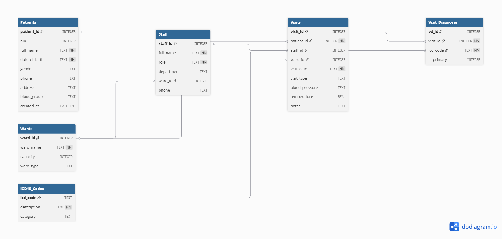

# Hospital Relational Database Design — General Hospital Keffi

A relational database designed for a real-world Nigerian healthcare facility, replacing a fragmented Excel-based records system with a structured, queryable SQLite database built to Third Normal Form (3NF).

Built as a capstone project for the **Microsoft Elevate AI Developers Program** (DP-900: Azure Data Fundamentals).

---

## Project Overview

General Hospital Keffi handles around 200 patient visits per week across eight wards. Their existing system — a mix of paper ledgers and an unmanaged Excel file — produced duplicate patient records, inconsistent diagnosis naming, and unreliable reporting.

This project redesigns that system from the ground up: an ERD, full table definitions, a populated SQLite database with real test data, and SQL queries that demonstrate what the new structure makes possible. The deployment section outlines how this schema would be hosted on **Azure SQL Database** in a real-world implementation.

---

## Tools & Standards

| Tool / Standard | Purpose |
|---|---|
| SQLite Browser | Local database creation and testing |
| dbdiagram.io | ERD design |
| WHO ICD-10 codes | Standardized diagnosis classification |
| SQL | Schema creation, data population, analytical queries |
| Azure SQL Database | Cloud deployment target |

---

## Database Schema

The database is built around six tables that reflect how the hospital actually operates.

### Entity-Relationship Diagram



### Tables

| Table | Description |
|---|---|
| `patients` | One record per patient — demographic details and contact info |
| `staff` | Doctors, nurses, and other healthcare workers |
| `wards` | Physical hospital sections (General, Maternity, Paediatrics, etc.) |
| `visits` | Core transactional table — one row per patient attendance |
| `diagnoses` | Standardized ICD-10 codes and their descriptions |
| `visit_diagnoses` | Bridge table — resolves the many-to-many between visits and diagnoses |

### Entity Relationships

| Table | Relates To | Relationship |
|---|---|---|
| Patients | Visits | One-to-many |
| Staff | Visits | One-to-many |
| Wards | Visits | One-to-many |
| Visits | Visit_Diagnoses | One-to-many |
| Diagnoses | Visit_Diagnoses | One-to-many |
| Visits | Diagnoses | Many-to-many (resolved via Visit_Diagnoses) |

### Normalization

The schema follows **Third Normal Form (3NF)** — no redundant data, every non-key column depends only on its table's primary key. Diagnoses are stored in a dedicated table using ICD-10 codes rather than free text, eliminating the naming inconsistencies common in manual entry systems.

---

## Files

```
├── README.md
├── schema.sql            # CREATE TABLE statements for all 6 tables
├── seed_data.sql         # INSERT statements matching test data
└── screenshots/
    ├── erd.png
    ├── patients_table.png
    ├── visits_table.png
    ├── diagnoses_table.png
    ├── query_common_diagnoses.png
    └── query_patient_history.png
```

---

## Key SQL Queries

**Most common diagnoses in a given month:**

```sql
SELECT
    d.icd10_code,
    d.description,
    COUNT(*) AS times_diagnosed
FROM visit_diagnoses vd
JOIN diagnoses d ON vd.diagnosis_id = d.diagnosis_id
JOIN visits v ON vd.visit_id = v.visit_id
WHERE v.visit_date BETWEEN '2026-03-01' AND '2026-03-31'
GROUP BY d.icd10_code, d.description
ORDER BY times_diagnosed DESC;
```

**Full visit history for a patient (dates, wards, diagnoses):**

```sql
SELECT
    p.first_name || ' ' || p.last_name AS patient_name,
    v.visit_date,
    w.ward_name,
    d.description AS diagnosis
FROM patients p
JOIN visits v ON v.patient_id = p.patient_id
LEFT JOIN wards w ON v.ward_id = w.ward_id
JOIN visit_diagnoses vd ON vd.visit_id = v.visit_id
JOIN diagnoses d ON vd.diagnosis_id = d.diagnosis_id
WHERE p.patient_id = 1
ORDER BY v.visit_date;
```

---

## Why This Beats Excel

### 1. Duplicate Patient Records
Excel has no enforcement mechanism — the same patient can appear multiple times with slightly different spellings. This database assigns each patient a unique `patient_id`, with constraints on fields like `phone_number` to catch duplicates before they enter the system.

### 2. Inconsistent Diagnosis Names
Manual entry produces entries like "Malaria", "Mal", and "P. falciparum" for the same condition, making accurate reporting impossible. This schema stores all diagnoses using standardized WHO ICD-10 codes — every reference to malaria points to `B54`, every time.

### 3. Reporting Capability
Generating a report in Excel means manual filtering, COUNTIF formulas, and significant room for error. With this schema, any report — most common diagnoses, ward load by month, full patient history — is a single SQL query that runs in seconds and produces consistent results every time.

---

## Azure Deployment

In a real-world implementation, this schema would be hosted on **Azure SQL Database** — Microsoft's fully managed relational database service.

The same schema created in SQLite translates directly to Azure SQL using standard T-SQL. Azure SQL Database handles infrastructure tasks like server management, automated backups, updates, and security — letting the hospital focus on using the data rather than maintaining the system.

This enables:

- **Scalability** — the database grows with the hospital without hardware upgrades
- **High Availability** — built-in redundancy keeps the system accessible even during failures
- **Security** — authentication, encryption, and role-based access control protect sensitive patient data
- **Accessibility** — authorized staff can connect from any location through integrated applications
- **BI Integration** — the database connects directly to Power BI for dashboards and reporting

---

## About This Project

This project was completed as part of the **Microsoft Elevate AI Developers Program**, Cohort 2 — a structured pathway toward the **DP-900: Azure Data Fundamentals** certification. The capstone brief required designing a relational database for a Nigerian healthcare context, building it locally in SQLite Browser, and outlining a cloud deployment strategy using Azure SQL Database.

**Program ID:** MSDEV-2026-3598
